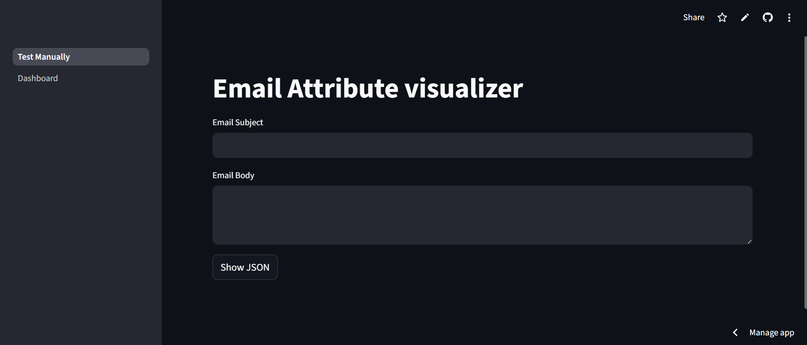
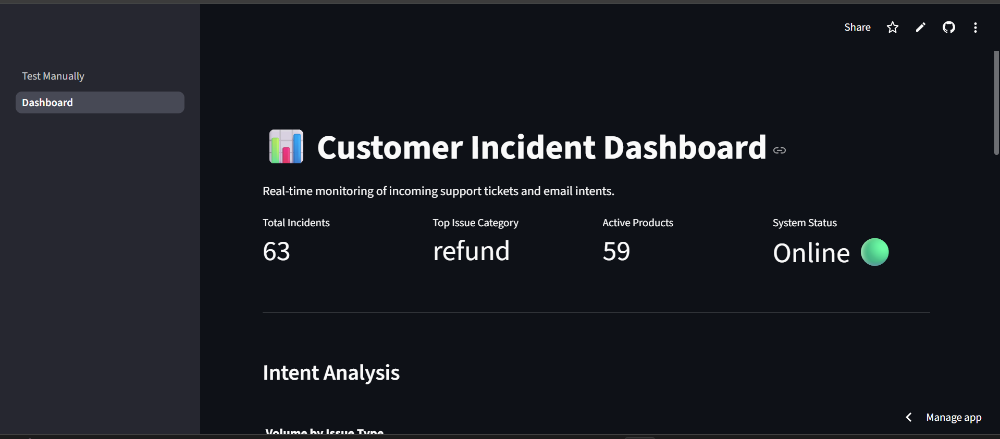

# Structured Insight Extractor from Emails

## Objective
Extract structured data and intent from raw email content for use in CRM automation or routing systems.

## Model Used

### Input Generation
- **Model:** `gemini-3-pro-preview` (via Google AI Studio)
- **Why?** To mimic emails in a real-world scenario, Gemini was used to create rich and realistic emails that depict real-world tickets received by a support team.

### Extracting Attributes
- **Model:**  : `openai`/`gpt-oss-120b`  (via Groq)
- **Why?** For extracting attributes from the email, we don't need the most expensive model. Instead, a simple model with fast inferencing and replicable results is crucial.
- **Groq Implementation:** Groq provides a free, fast inference API to open-source models (like Llama 3 or Mixtral). The API also supports structured outputs (JSON mode), which is required for the task at hand.

## Usage

This project uses `uv` for dependency management.

### 1. Installation
If you don't have `uv` installed:
```bash
pip install uv
```
Install the project requirements:
```Bash
uv sync
```
### 2. API Configuration
1. Get an API key from Groq: https://console.groq.com/home
2. Set the API key as an environment variable:
#### Mac/Linux:

```Bash
export GROQ_API_KEY="your_api_key_here"
```
#### Windows (PowerShell):

```Powershell
$env:GROQ_API_KEY="your_api_key_here"
```
### 3. Running the Project
#### Notebook Analysis:
You can step through the logic using the Jupyter notebook:
```Bash
jupyter notebook assignment3.ipynb
```
#### Test Script:
To test the extractor on a single example, modify the subject and body variables in test.py and run:
```
Bash
uv run test.py
```
## App
I have built a Streamlit app with an incidents dashboard that automates the pipeline.
#### Live App: https://assignmentpega.streamlit.app/dashboard
#### Workflow
1. Polls: Checks helpdeskpega@gmail.com via IMAP every 10 seconds.
2. Fetches: Retrieves new emails.
3. Parses Headers: Extracts metadata (User, Email, Subject) directly from email headers.
4. Extracts Attributes: Uses the attribute_parsing module (LLM) to identify Intent, Product, etc.
5. Stores: Creates a new incident record in the SQLite database.

#### Dashboard Views
1. Manual Attribute Check
Inspects the parsing logic on individual emails.


2. Dedicated Dashboard
A view for the support team to track incoming tickets.


## Key Challenges

### Dataset Availability
- The major challenge was finding a dataset. While there are few email dataset that exist online, they are not a perfect fit for the problem. 
- Hence I had to synthesize a dataset that coveres real world scenarios for a CRM support system. 
- This was done to ensure that the solution being built can be tested properly from a real world scenario

## Assumptions

The following design choices were made during development:

1. Non-LLM Extraction:
    - Metadata like Sender Name, Email Address, and Timestamp are extracted via Regex/Headers to ensure accuracy and reduce LLM overhead.
2. Intent Flexibility:
    - We assume intent is not limited to a fixed taxonomy. The system handles open-ended intents. In a production environment these would map to a specific list, with unmappable items routed to an "Others" queue.
3. Handling Missing Data:
    - To prevent hallucination, the LLM is explicitly instructed to return None if a specific attribute is not found in the text.
4. Field Requirements:
    - Mandatory: Intent, Product (Crucial for routing).
    - Optional: Customer Name (Often missing in body), Requested Action (Implied).